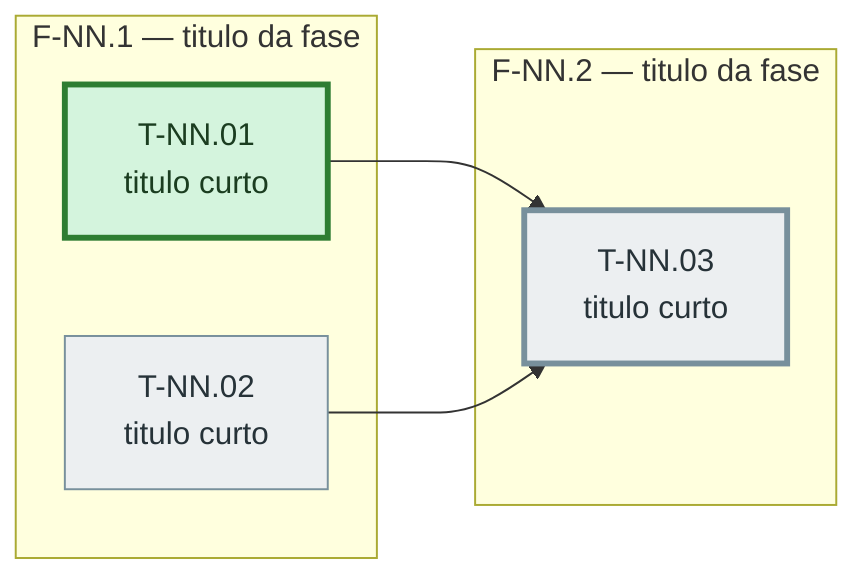
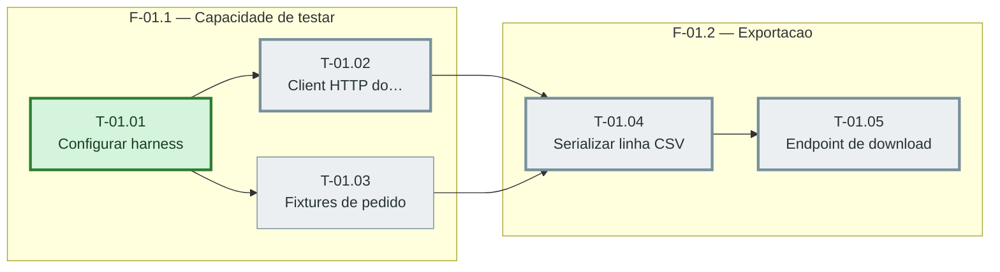

# O diagrama do grafo de tasks — bloco Mermaid em `fases.md`

Leitura obrigatória quando a F3 grava `fases.md` e quando a F6 fecha uma task.

O plano já declara paralelismo e dependência, task a task, nos campos `depende_de` e
`paralelizavel`. O que ele não faz é **mostrar**: numa sprint de doze tasks, descobrir o que
corre junto exige cruzar a lista inteira na cabeça. O diagrama resolve isso sem infraestrutura
nenhuma — VS Code e GitHub renderizam Mermaid dentro de Markdown, no editor, no preview e no
pull request.

O leitor precisa entender duas coisas em três segundos: **o que corre em paralelo** e **o que
trava tudo**.

## O que este arquivo não é

O diagrama é uma **representação derivada**. Ele não cria regra, não altera contrato, não
muda o comportamento de fase nenhuma e não vira pré-requisito de nada. Em qualquer conflito
entre o que este arquivo diz e o que a skill manda, **vence a skill**.

A ausência do diagrama é inofensiva: um `fases.md` sem bloco Mermaid continua sendo um
`fases.md` válido, a F5 não o audita e a F6 não o exige. Nunca deixe a geração ou a
atualização do diagrama bloquear o trabalho.

## Onde vive

Dentro de `docs/sprintx/features/<slug>/sprint-NN/fases.md`, **abaixo do frontmatter e acima
da prosa das fases**. Um diagrama por sprint.

Não crie arquivo novo para ele. O diagrama vive junto do conteúdo que representa; num arquivo
à parte, ele ficaria desatualizado num canto sem ninguém perceber.

## De onde sai — derivação, nunca invenção

O grafo sai **exclusivamente** de cinco campos das tasks daquela sprint, lidos de `tasks.md`:

| Campo | Vira o quê no diagrama |
|---|---|
| `id` | o identificador do nó e o começo do rótulo |
| `titulo` | o resto do rótulo, cortado |
| `fase` | o subgraph que agrupa o nó |
| `depende_de` | as setas que chegam ao nó |
| `status` | a cor do nó |

Nada mais entra. Não invente dependência que os campos não afirmam, não agrupe por
proximidade de assunto, não desenhe seta "implícita" entre tasks vizinhas, não use
`paralelizavel` para criar aresta. Paralelismo no diagrama é **ausência** de caminho entre
dois nós, não um traço a mais.

## Quando o diagrama NÃO é gerado — a contradição é erro de plano

Se dois campos se contradisserem, **não gere o diagrama** e reporte a contradição como **erro
de plano**. Isso é um achado valioso — o diagrama descobriu um plano inconsistente antes de a
execução descobrir —, não um problema de renderização, e nunca se resolve desenhando o grafo
"do jeito que dá".

Contradições que impedem a geração:

1. `paralelizavel: true` com `depende_de` não vazio. Uma task que espera outra não corre em
   paralelo com o que ela espera; os dois campos não podem ser verdade ao mesmo tempo.

   Este é o caso que a F5 chama de **paralelismo falso** (`references/05-auditoria.md`, achado
   5), visto do lado do grafo. O diagrama não julga se a task *poderia* correr junto de alguma
   outra — ele só constata que os dois campos, como estão escritos, não podem ser ambos
   verdade. A correção é sempre no plano, nunca no diagrama: ou a dependência é real e
   `paralelizavel` é `false`, ou o paralelismo é real e `depende_de` é `[]`.

2. `depende_de` apontando para `id` que não existe no plano.
3. Ciclo de dependência: A depende de B que depende de A (direta ou indiretamente).
4. `status: concluida` numa task cuja dependência não está `concluida`.
5. `fase` de uma task que não consta da lista `fases:` do frontmatter de `fases.md`.

Na F3, uma contradição dessas é para **corrigir agora**, na própria fase — é o lugar de mexer
no plano. Corrija a inconsistência, e o diagrama passa a ser gerável. Na F6, onde plano não se
altera, registre o achado e siga sem diagrama: a execução não para por causa dele.

**Como reportar:**

```
Diagrama não gerado — contradição no plano (sprint-02):
  T-02.05 declara paralelizavel: true e depende_de: [T-02.03]
Corrija o plano; o diagrama é derivado e não pode ser desenhado sobre campos que se contradizem.
```

Uma linha por contradição, dizendo qual task e quais campos brigam. Não desenhe nada, nem
parcialmente, enquanto houver contradição aberta na sprint.

## O formato exato do bloco

````markdown

````

A ordem das seções é fixa: comentário, `flowchart LR`, subgraphs com os nós, arestas,
`classDef`, `class`. Nada além disso.

### Identificadores de nó

**Sem acento, sem ponto, sem hífen, sem espaço.** O texto visível pode ter acento; o
identificador não. Derive o identificador do `id` da task trocando `-` e `.` por `_`:

```
T-01.02  →  T_01_02
F-02.1   →  fase_02_1
```

O identificador do subgraph nunca colide com o de uma task porque começa por `fase_`.

### Rótulo do nó

Sempre entre aspas duplas, no formato `"<id da task><br/><título cortado>"`. O `id` mantém a
grafia original, com hífen e ponto — ele está dentro das aspas, é texto visível.

O título é **cortado em 28 caracteres**, no espaço anterior ao limite, com reticências quando
cortado: `"Criar client HTTP autenticado do fornecedor"` vira `"Criar client HTTP…"`. Título
comprido estica o nó, e nó largo transforma o grafo numa escada ilegível.

**Caracteres que quebram o parse do Mermaid, e o que fazer:** aspas duplas (`"`) viram aspas
simples; colchetes (`[` `]`), chaves (`{` `}`) e parênteses (`(` `)`) são removidos; `|`, `<`
e `>` são removidos; `#` e `&` são removidos. Acento no texto visível pode ficar. Se depois
da limpeza o título ficar vazio, use só o `id`.

### Orientação

Sempre `flowchart LR` — da esquerda para a direita, que é como se lê dependência: o que vem
antes fica à esquerda do que depende dele. Nunca `TD`, `TB`, `RL` nem `BT`.

### Agrupamento por fase

Um `subgraph` por fase da sprint, na ordem em que as fases aparecem no frontmatter, contendo
os nós das tasks daquela fase. Task sem `fase` declarada fica fora de qualquer subgraph, solta
no diagrama — não invente uma fase para ela.

As arestas ficam **fora** dos subgraphs, todas juntas, depois do último `end`. Aresta dentro
de subgraph faz o Mermaid puxar o nó de destino para dentro do grupo errado.

### As arestas

Uma aresta por par `(dependência, task)`, sempre `-->`, sempre no sentido dependência → task.
Uma task com `depende_de: [T-01.01, T-01.02]` gera duas arestas. Task com `depende_de: []` não
gera aresta nenhuma — e é exatamente isso que faz o paralelismo aparecer: nós sem seta entre
si, lado a lado.

Não use rótulo de aresta, não use `-.->`, `==>` nem `---`. Uma seta só, sempre a mesma.

### Status por cor

Só quando o campo `status` existir na task. Os quatro valores do contrato mapeiam assim:

| `status` | classe | Leitura |
|---|---|---|
| `concluida` | `concluida` | verde |
| `em_andamento` | `andamento` | âmbar |
| `bloqueada` | `bloqueada` | vermelho |
| `pendente` | `pendente` | cinza |

Declare as quatro `classDef` sempre, mesmo que uma delas não seja usada naquela sprint: assim
o bloco é o mesmo em todas as sprints, e a F6 só precisa trocar a linha `class` de um nó.

**Uma linha `class` por task**, com um nó só por linha, na ordem dos ids. É isso que torna a
atualização da F6 uma troca de palavra numa linha, em vez de uma reescrita do bloco.

### O caminho crítico

O caminho crítico é a **cadeia mais longa de tasks sequenciais** da sprint — a maior
quantidade de tasks que precisam acontecer uma depois da outra. É ela que limita o calendário:
por mais gente que se ponha na sprint, ela não termina antes dessa cadeia.

Como derivar, contando tasks (não esforço — esforço não é campo do contrato da task):

1. Para cada task sem dependência, o comprimento é 1.
2. Para as demais, o comprimento é 1 + o maior comprimento entre as tasks de `depende_de`.
3. O caminho crítico é a cadeia que termina no maior comprimento, refeita para trás pelo
   antecessor que deu o máximo.
4. **Empate: escolha a cadeia cujo último id é menor** (ordem alfabética do `id`). Um critério
   qualquer, desde que determinístico — o mesmo plano tem que gerar sempre o mesmo diagrama.

Marque essa cadeia com uma linha `class` única, listando os nós separados por vírgula, com a
classe `critico`. A classe só engrossa a borda: ela **soma** ao status em vez de substituí-lo,
então um nó do caminho crítico continua mostrando a própria cor. Por isso a linha do `critico`
vem **depois** de todas as linhas de status.

Quando toda a sprint for uma cadeia única, o caminho crítico é a sprint inteira — marque
mesmo assim; a informação "não há nada em paralelo aqui" é útil.

## Estilo — o que não fazer

Nenhum estilo além das cinco `classDef` acima. Sem `style` por nó, sem `linkStyle`, sem
`themeVariables`, sem ícone, sem `direction` dentro de subgraph, sem forma de nó diferente de
`[" "]`. Diagrama enfeitado fica ilegível em tela pequena, que é onde ele mais precisa
funcionar.

## Limite de tamanho — regra dura

**Acima de 25 tasks numa sprint, não gere um diagrama único.** Acima disso o grafo não cabe na
tela e passa a atrapalhar mais do que ajuda. Nunca gere um diagrama que não caiba numa tela.

Com 26 tasks ou mais, gere no lugar:

1. **Um diagrama de visão geral**, primeiro, só com as fases como nós e as dependências entre
   fases. A dependência entre fases é derivada das tasks: existe aresta de `F-A` para `F-B`
   quando alguma task de `F-B` depende de alguma task de `F-A`. Sem repetir a aresta, e sem
   auto-aresta quando as duas tasks são da mesma fase. O nó da fase mostra a quantidade de
   tasks, no formato `"F-NN.M<br/>título da fase — 8 tasks"` — **sem parênteses**, que estão
   na lista de caracteres removidos do rótulo. O caminho crítico entre fases é destacado com a
   mesma classe `critico`, calculado sobre o grafo de fases: o comprimento de cada fase é 1, e
   a cadeia mais longa é a de fases encadeadas, com o mesmo desempate por menor `id`.
2. **Um diagrama por fase**, na sequência, cada um com as tasks daquela fase, sem subgraph
   (o título da seção já diz de que fase é), com as arestas internas da fase.

Cada diagrama vai precedido de um título de nível 3 (`### Visão geral das fases`,
`### F-NN.M — título da fase`), e todos ficam na mesma posição de sempre: abaixo do
frontmatter, acima da prosa das fases.

Se uma fase sozinha passar de 25 tasks, a fase está grande demais — registre isso junto com o
diagrama, como observação de plano, e gere o diagrama dela mesmo assim: o limite existe para
a sprint, e não há subdivisão abaixo de fase para onde quebrar.

Dependência que atravessa fases não aparece no diagrama por fase — ela está no de visão geral.
Não desenhe nó fantasma de outra fase.

## Quando gerar e quando atualizar

**Na F3, ao gravar `fases.md`:** gere o bloco inteiro, com todos os nós em `pendente` (é o
status inicial de toda task no plano) e o caminho crítico marcado. Um replanejamento (retorno
da F5) regera o bloco do zero — o grafo mudou.

**Na F6, ao fechar cada task:** troque a classe daquele nó na linha `class` correspondente, e
nada mais. Não recalcule o caminho crítico, não reordene nada, não reescreva o bloco: a
estrutura do grafo não muda durante a execução, só a cor muda. A mesma troca vale para
`em_andamento` e `bloqueada`.

**Se a atualização falhar** — arquivo com bloco em formato inesperado, nó não encontrado,
`fases.md` sem bloco Mermaid nenhum —, registre e siga. Uma linha no rastro
(`references/08-rastro.md`) com `resultado: aviso` e o motivo, e a execução continua. O
diagrama é derivado e **nunca** pode bloquear o trabalho, nem impedir uma task de fechar.

Se `fases.md` não tem bloco Mermaid (plano gerado por uma versão anterior da skill), a F6 não
o cria: gerar diagrama é papel da F3. Siga sem avisar.

## Exemplo correto

Sprint de 5 tasks em duas fases. `T-01.02` e `T-01.03` não dependem uma da outra e correm em
paralelo; a cadeia mais longa é `T-01.01 → T-01.02 → T-01.04 → T-01.05`, com quatro tasks.
`T-01.01` já fechou.

````markdown

````

Por que está correto: identificadores sem acento e sem pontuação; orientação `LR`; arestas
fora dos subgraphs; uma linha `class` por task, o que torna a atualização da F6 trivial;
caminho crítico depois dos status, somando borda grossa sem apagar cor; `T-01.02` e `T-01.03`
lado a lado, sem seta entre si — o paralelismo aparece sozinho.

## Exemplo incorreto

````markdown
```mermaid
graph TD
  subgraph Fase 1 — Capacidade de testar
    T-01.01[Configurar harness de teste com pytest e fixtures]
    T-01.02(Client HTTP)
    T-01.01 --> T-01.02
  end
  T-01.02 -.->|paralelo| T-01.03
  style T-01.01 fill:#0f0,stroke:#000,stroke-width:5px,color:#fff
  linkStyle 0 stroke:#f00
```
````

O que está errado, linha a linha:

- `graph TD` — orientação de cima para baixo, e sintaxe antiga. É `flowchart LR`.
- `subgraph Fase 1 — Capacidade de testar` — título sem aspas e com travessão: quebra o parse.
- `T-01.01` como identificador — hífen e ponto no identificador. É `T_01_01`, com o `id`
  original só dentro do rótulo.
- `[Configurar harness de teste com pytest e fixtures]` — rótulo sem aspas e sem corte: estica
  o nó e deforma o grafo.
- `(Client HTTP)` — forma de nó diferente das demais, sem motivo.
- `T_01_01 --> T_01_02` dentro do subgraph — aresta pertence à seção de arestas, depois do
  `end`.
- `-.->|paralelo|` — aresta pontilhada com rótulo, e pior: uma aresta inventada a partir de
  `paralelizavel`. Paralelismo é ausência de aresta, nunca uma aresta.
- `style` por nó e `linkStyle` — estilo fora das `classDef`, que a F6 não sabe atualizar e que
  fica ilegível em tela pequena.
- Falta o comentário `%%` de cabeçalho e faltam as `classDef` de status.

## Verificação antes de gravar

- [ ] O bloco está abaixo do frontmatter e acima da prosa das fases.
- [ ] Nenhuma das cinco contradições da seção "Quando o diagrama NÃO é gerado" está presente.
- [ ] Primeira linha do grafo é `flowchart LR`.
- [ ] Todo identificador de nó casa com `[A-Za-z_][A-Za-z0-9_]*` — sem acento, ponto, hífen ou
      espaço.
- [ ] Todo rótulo está entre aspas duplas e sem `"`, `[`, `]`, `{`, `}`, `(`, `)`, `|`, `<`,
      `>`, `#` ou `&` dentro.
- [ ] Toda aresta está fora dos subgraphs e usa `-->`.
- [ ] Toda aresta corresponde a um `depende_de` real; nenhuma aresta foi inventada.
- [ ] Uma linha `class` por task, com o status certo, e a linha do `critico` por último.
- [ ] A sprint tem no máximo 25 tasks; acima disso, há um diagrama por fase mais o de visão
      geral.
